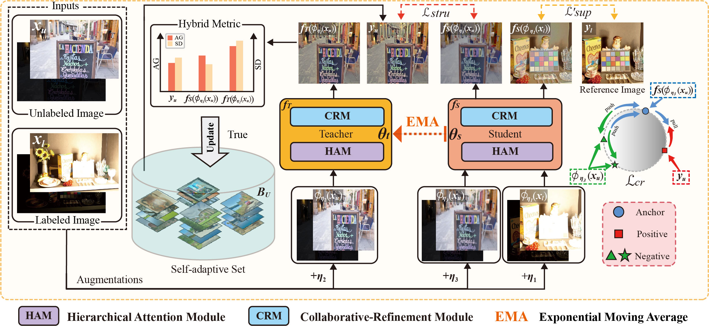

# [SAMT-MEF](https://www.sciencedirect.com/science/article/pii/S1566253524003129)

Official Code for: Qianjun Huang, Guanyao Wu, Zhiying Jiang, Wei Fan*, Bin Xu and Jinyuan Liu, **“Leveraging a Self-adaptive Mean Teacher Model for Semi-supervised Multi-Exposure Image Fusion”**, Information Fusion[J], 2024.

- [*[Information Fusion]*](https://www.sciencedirect.com/science/article/pii/S1566253524003129)
- [*[Google Scholar]*](https://scholar.google.com/scholar?hl=zh-CN&as_sdt=0%2C5&q=Leveraging+a+self-adaptive+mean+teacher+model+for+semi-supervised+multi-exposure+image+fusion&btnG=)

## :globe_with_meridians: Overview
---



## Network Architecture
.jpg)

---

## :computer: Set Up on Your Own Machine

### Virtual Environment

We strongly recommend that you use Conda as a package manager.

```shell
# create virtual environment
conda create -n SAMT-MEF python=3.8
conda activate SAMT-MEF
# select and install pytorch version yourself (Necessary & Important)
# install requirements package
pip install -r requirements.txt
```
### Train
```shell
# Initializes the self-adaptive set
python create_candidate.py

# Train: 
python train.py
```
### Test
You can find the pre-trained checkpoint in `./model/ckpt` document.
```shell
# Test: 
python test.py

```
## :mag_right: Comparison
___

### Preview


### Visual Comparison on [SICE](https://github.com/csjcai/SICE#learning-a-deep-single-image-contrast-enhancer-from-multi-exposure-images) Dataset


### Visual Comparison on [Mobile](https://github.com/Hedlen/MEFLUT) Dataset


### Visual Comparison on [MEF](https://github.com/hangxiaotian/Perceptual-Multi-exposure-Image-Fusion) Dataset


### Application on High-level task


### Quantitative comparison on [SICE](https://github.com/csjcai/SICE#learning-a-deep-single-image-contrast-enhancer-from-multi-exposure-images) and [Mobile](https://github.com/Hedlen/MEFLUT) Dataset


____

## :pushpin: Citation

If this work has been helpful to you, we would appreciate it if you could cite our paper! 

```BibTex
@article{huang2024leveraging,
  title={Leveraging a self-adaptive mean teacher model for semi-supervised multi-exposure image fusion},
  author={Huang, Qianjun and Wu, Guanyao and Jiang, Zhiying and Fan, Wei and Xu, Bin and Liu, Jinyuan},
  journal={Information Fusion},
  pages={102534},
  year={2024},
  publisher={Elsevier}
}
```
## :email:Contact

If you have any questions, please feel free to reach out at `hqj9994ever@gmail.com`. 